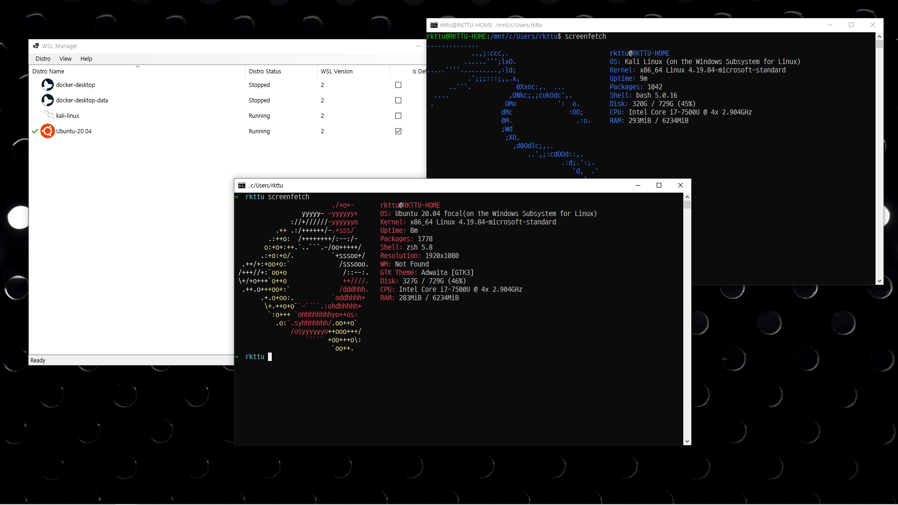

# WSL Manager

You can access or contribute to the source code of this project from the GitHub repository: [https://github.com/rkttu/WslManager](https://github.com/rkttu/WslManager)

**WSL Manager** is a highly customizable Windows Subsystem for Linux distro manager for Windows 10 (at least 2004) and Windows Server 2004 (or later).

This program helps you install and manage multiple versions of the same Linux distribution on the Windows Subsystem for Linux. This program is currently under development and may take some time to complete its first function.

## Features

* Run your linux distro easily with GUI based interface.
* Open your linux distro directly.
* Import your own system tarball archive to Windows Subsystem for Linux.
* Export your existing distro to tarball archive file.
* Issue a command or script into distro directly.
* Set default distro for wsl.exe.
* Run distro as a specific user.

## Planned features/enhancements

All planned features and enhancements listed in the [enhancements label](https://github.com/wslhub/WslManager/labels/enhancement).

## FAQ

### The functionality of this tool is already provided by wsl.exe. Why should I use this tool?

This tool is designed to enable the use of WSL functionality in a GUI manner. Of course, it is useful to call wsl.exe directly if you are familiar with using the command line.

However, if you use this tool, you will get additional productivity when managing multiple distros in your system.

## License

This project follows the [MIT license](License.txt).

## Thanks to

- App Icons: https://www.icons8.com
- Project temporary logo: https://commons.wikimedia.org/wiki/File:Penguin_window_by_mimooh.svg
